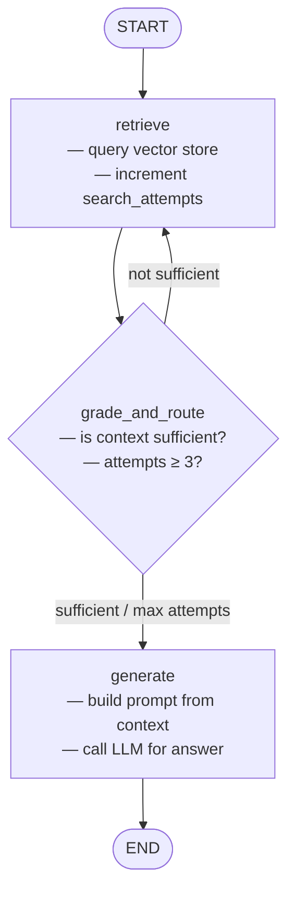

# 04 — Explicit LangGraph with Corrective RAG

## What This Example Does

This example builds a **corrective RAG pipeline** using LangGraph's explicit graph API — no `create_agent` abstraction. It answers a question about an HR policy document by:

1. **Retrieving** relevant chunks from a Chroma vector store (built from `sample.txt`)
2. **Grading** whether the retrieved context is sufficient to answer the question
3. **Looping back** to retrieve again if the context is inadequate (up to 3 attempts)
4. **Generating** a final answer once the context passes grading (or the attempt limit is hit)

The key learning here is that LangGraph makes the routing logic explicit and visible — the `grade_and_route` conditional edge function is the same decision-making that `create_agent` hides behind tool-call loops.

## Graph



## State

```python
class State(TypedDict):
    question: str          # the user's question (set once at the start)
    context: list[str]     # retrieved document chunks (updated each retrieve)
    answer: str            # final answer (set by generate)
    search_attempts: int   # how many times retrieve has run
```

## Nodes

| Node | Role |
|------|------|
| `retrieve` | Queries the vector store for the top-3 chunks; increments `search_attempts` |
| `generate` | Calls the LLM with the accumulated context to produce a final answer |

## Edges

| From | To | Condition |
|------|----|-----------|
| `START` | `retrieve` | always |
| `retrieve` | `generate` | `grade_and_route` returns `"sufficient"` or `search_attempts >= 3` |
| `retrieve` | `retrieve` | `grade_and_route` returns `"retry"` |
| `generate` | `END` | always |
