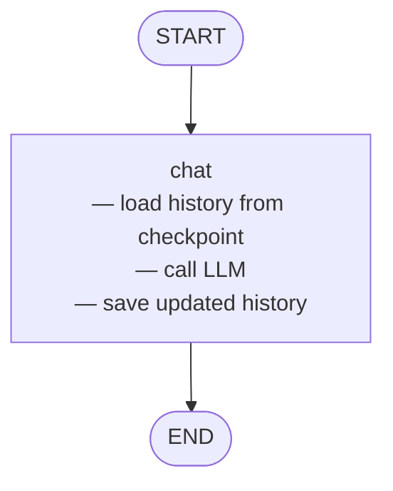

# 05 — LangGraph Persistence (Checkpointers)

## What This Example Does

Adds a **checkpointer** to a LangGraph so that conversation state is saved after
every node and can be resumed later — even after the process restarts.

The graph itself is simple (one `chat` node). The interesting part is what
wraps it: a `SqliteSaver` that writes each thread's message history to
`memory.db`, and the `add_messages` reducer that handles merging new messages
into the saved history automatically.

The demo runs three turns to show two key properties:

| Turn | Thread | What it proves |
|------|--------|----------------|
| 1 | `alice` | Ask "What is RAG?" — answered normally |
| 2 | `alice` | Ask "What did I just ask about?" — LLM recalls RAG from turn 1 |
| 3 | `bob` | Same follow-up question — LLM has no context (different thread) |

At the end, `app.get_state(config)` is used to inspect the full checkpoint,
showing all four messages stored for Alice.

## Graph



The graph is trivial — persistence is entirely handled by the checkpointer
sitting outside the nodes.

## The Two Key Concepts

### 1. `add_messages` reducer

```python
class State(TypedDict):
    messages: Annotated[list, add_messages]
```

Without this, each `invoke` call would **replace** `messages` with whatever
you passed in. With `add_messages`, LangGraph **appends** new messages to the
existing list. This is what gives you a growing conversation history without
manually tracking it.

### 2. Checkpointer + `thread_id`

```python
with SqliteSaver.from_conn_string("memory.db") as checkpointer:
    app = graph.compile(checkpointer=checkpointer)

config = {"configurable": {"thread_id": "alice"}}
app.invoke({"messages": [HumanMessage("...")]}, config)
```

- The checkpointer intercepts every state update and writes it to `memory.db`
- `thread_id` scopes state — each thread is a fully independent conversation
- On the next `invoke` with the same `thread_id`, the checkpoint is loaded and
  merged with the incoming message before the node runs

## Checkpointer Options

| Checkpointer | Where state lives | Use case |
|---|---|---|
| `MemorySaver` | In-process RAM | Unit tests, quick demos |
| `SqliteSaver` | SQLite file on disk | Local dev, single-process apps |
| `PostgresSaver` | Postgres DB | Production, multi-process |

## Inspecting State

```python
snapshot = app.get_state(config)
snapshot.values["messages"]   # full message list for this thread
snapshot.next                 # which node would run next (empty if at END)
```
