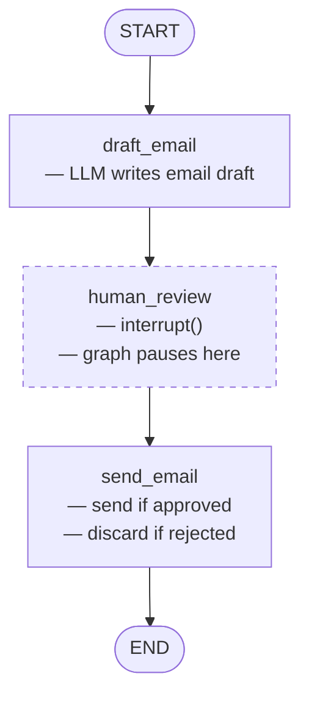

# 06 — Human-in-the-Loop (interrupt / resume)

## What This Example Does

Builds a graph that **pauses mid-execution** to let a human review an LLM-produced
email draft before it is sent. The graph only resumes when the caller explicitly
provides a decision.

Two runs are shown:
- **Approve** — graph resumes, email is "sent"
- **Reject** — graph resumes, email is discarded

## Graph



The dashed node is where execution pauses — the caller gets control back.

## The Two Key Concepts

### 1. `interrupt()` — pause and surface a value

```python
def human_review(state: State) -> Command:
    decision = interrupt({
        "message": "Review the email draft. Approve or reject?",
        "draft": state["draft"],
    })
    # execution stops here until Command(resume=...) is called
    approved = decision.strip().lower() == "approve"
    return Command(update={"approved": approved})
```

- `interrupt(value)` saves the graph state at this exact point and returns
  control to the caller
- The dict passed to `interrupt()` is surfaced in `result["__interrupt__"]`
  so the caller can inspect it
- Whatever the caller passes to `Command(resume=...)` becomes the return
  value of `interrupt()` when the graph resumes

### 2. Two `invoke()` calls for one logical run

```python
# Turn 1 — runs until interrupt
result = app.invoke({"messages": [...], ...}, config)
# result["__interrupt__"] contains the draft for review

# Turn 2 — resume with human decision
result = app.invoke(Command(resume="approve"), config)
# graph continues from human_review, runs send_email, reaches END
```

The **same `thread_id`** ties the two calls together — the checkpointer
restores the saved state before resuming.

## Why `MemorySaver` is enough here

`SqliteSaver` persists state across process restarts. `MemorySaver` keeps it
in RAM within the same process. For this demo both `invoke()` calls happen in
the same script, so `MemorySaver` is sufficient and simpler.

In production (e.g. a web app where turn 1 and turn 2 are separate HTTP
requests), you would use `SqliteSaver` or `PostgresSaver`.

## interrupt() vs interrupt_before

Two ways to add a human pause:

| Approach | Where configured | What gets interrupted |
|---|---|---|
| `interrupt()` inside a node | In the node function | Exactly where you call it — mid-node |
| `interrupt_before=["node"]` at compile | In `graph.compile(...)` | Before the named node runs |

`interrupt()` is more flexible — you can conditionally pause (only interrupt
if the draft looks risky), or pause at different points within the same node.
`interrupt_before` is simpler when you always want to pause before a whole node.
