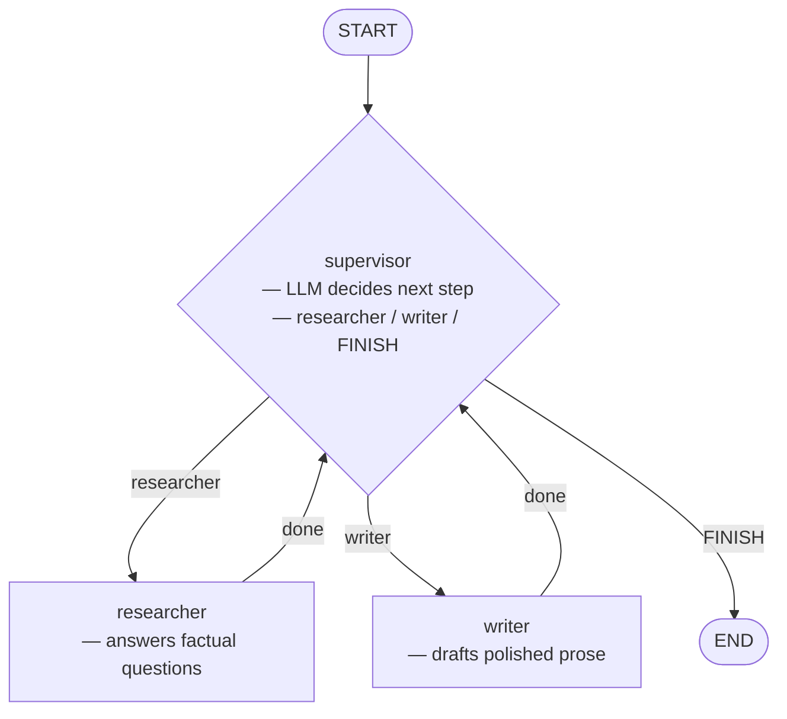

# 08 — Multi-Agent (Supervisor Pattern)

## What This Example Does

A **supervisor agent** orchestrates two specialist agents to complete a task
that requires both research and writing:

1. **Supervisor** — reads the conversation and decides which specialist to call next, or declares `FINISH`
2. **Researcher** — answers factual questions concisely
3. **Writer** — takes research notes and rewrites them as polished prose

The supervisor is the hub — every specialist routes back to it after finishing.
The supervisor decides when the task is done.

## Graph



## How Routing Works — `Command(goto=...)`

Specialists and the supervisor both return `Command` instead of a plain dict:

```python
# Specialist — always routes back to supervisor when done
def researcher(state) -> Command[Literal["supervisor"]]:
    response = llm.invoke(...)
    return Command(
        update={"messages": [response]},  # state update
        goto="supervisor",                # next node
    )

# Supervisor — routes to a specialist or ends the graph
def supervisor(state) -> Command[Literal["researcher", "writer", "__end__"]]:
    decision = llm.invoke(...)  # returns "researcher", "writer", or "FINISH"
    if decision == "FINISH":
        return Command(goto=END)
    return Command(goto=decision)
```

`Command` combines two things that were separate before:
- `update` — the state change (same as returning a dict from a node)
- `goto` — which node to run next (replaces `add_conditional_edges`)

## How the Supervisor Decides

The supervisor is just an LLM call with a system prompt that constrains its
output to exactly one of three words. No tools, no structured output — just
prompt engineering:

```
Reply with ONLY one of: researcher, writer, FINISH

Rules:
- Call researcher first if factual information is needed
- Call writer after researcher has provided facts
- Reply FINISH when the writer has produced a final draft
```

This is the simplest version of a supervisor. In a real system you might use
structured output (`.with_structured_output()`) to make the routing more
reliable.

## Shared State as the Communication Channel

All agents read from and write to the same `messages` list. This is how they
"talk" to each other — the researcher's output is in `messages` when the
writer runs, so the writer can see what was researched without any explicit
handoff.

This works for simple pipelines. For complex multi-agent systems, agents
may have their own private state in addition to shared state.

## Run Order

```
supervisor -> researcher -> supervisor -> writer -> supervisor -> END
```

The supervisor runs 3 times — once to dispatch, once to hand off, once to
finish. This overhead is the cost of flexible routing.
