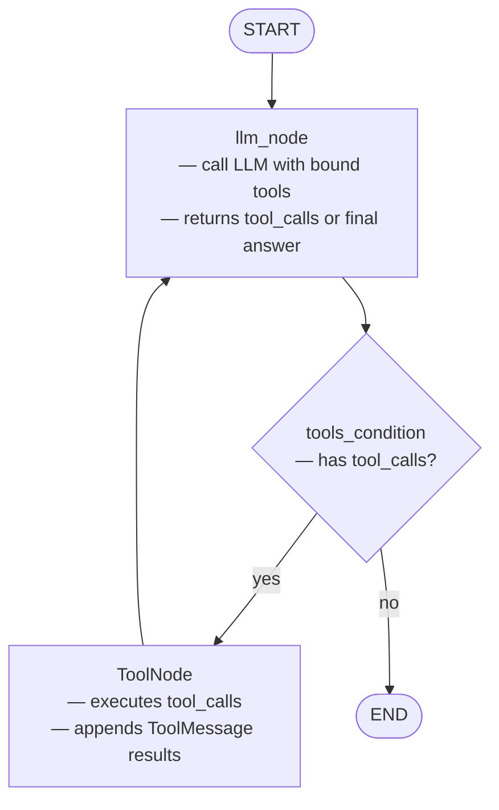

# 09 — Tool Nodes

## What This Example Does

Uses `ToolNode` — a prebuilt LangGraph node — to handle tool execution
automatically. The LLM decides which tools to call; `ToolNode` executes them
and appends the results; the LLM continues with the results in context.

Two tools are defined: a calculator and a mock weather lookup. A single
question requires both, so the LLM calls them in parallel in one turn.

## Graph



## The Two Prebuilt Pieces

### `ToolNode`

```python
graph.add_node("tools", ToolNode(tools))
```

Inspects the last `AIMessage` in state for `tool_calls`, executes each
function, and appends `ToolMessage` results to `messages`. You don't write
any of this — it's handled for you.

Without `ToolNode`, you would write this manually:

```python
def tool_node(state):
    last = state["messages"][-1]
    results = []
    for tc in last.tool_calls:
        fn = tool_map[tc["name"]]
        result = fn.invoke(tc["args"])
        results.append(ToolMessage(content=str(result), tool_call_id=tc["id"]))
    return {"messages": results}
```

`ToolNode` does exactly that, plus error handling and parallel execution.

### `tools_condition`

```python
graph.add_conditional_edges("llm", tools_condition)
```

A prebuilt routing function:
- Last message has `tool_calls` -> route to `"tools"`
- Last message has no `tool_calls` -> route to `END`

Replaces the manual `grade_and_route` pattern from earlier examples.

## How Tools Are Defined

```python
@tool
def calculate(expression: str) -> str:
    """Evaluate a mathematical expression."""  # <- LLM reads this docstring
    return str(eval(expression))
```

The `@tool` decorator turns a plain function into a LangChain tool. The
docstring becomes the description the LLM uses to decide when to call it.
The type annotations become the argument schema.

## Binding Tools to the LLM

```python
llm = ChatOpenAI(...).bind_tools(tools)
```

This tells the LLM what tools exist. When the LLM decides to use one, it
returns an `AIMessage` with `tool_calls` populated (structured JSON) instead
of plain text. The content field is empty at that point — the answer comes
after `ToolNode` runs and the LLM sees the results.

## Message Flow

```
HumanMessage("What is 15 * 7 and weather in Tokyo?")
    |
AIMessage(tool_calls=[calculate("15*7"), get_weather("Tokyo")])   <- LLM turn 1
    |
ToolMessage("105")                                                 <- ToolNode
ToolMessage("18C, partly cloudy")                                  <- ToolNode
    |
AIMessage("15 * 7 is 105. Tokyo is 18C, partly cloudy.")          <- LLM turn 2
```

The LLM runs twice. `ToolNode` runs once between them.
Parallel tool calls (both tools in one turn) are handled automatically.
